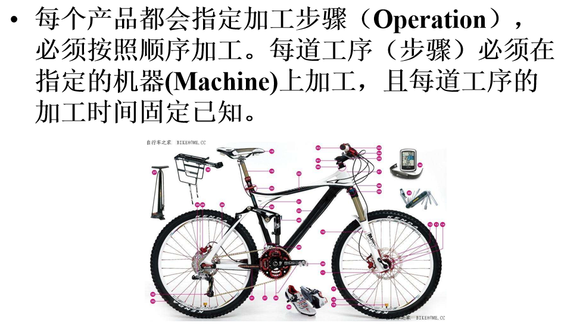
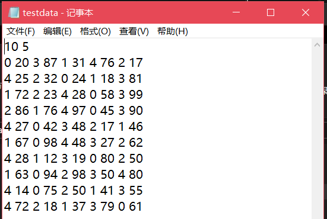
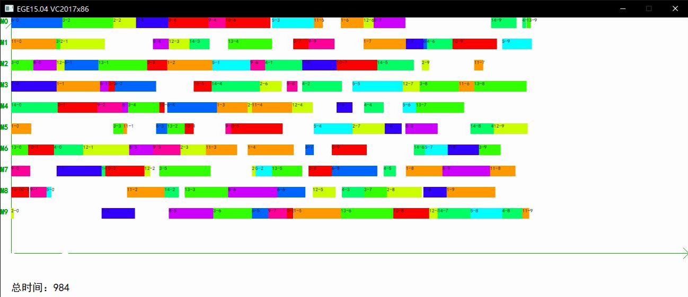

It's developed by my best companions-Zibo Chan,Yifan Zhu,and me.
We shared a fantastic week to complete this project and achieved 100 grade at 2018's summer.
Many thanks to my friends who once gived me advice on some details of this project.
And many thanks to 张老师.

## Description
要解决的问题：
现在有若干个商品等待加工，加工厂的加工机器有限，每一个商品都需要N道加工工序，并且在指定的机器加工指定市场完成整体加工，如何组织加工工作让这若干个商品加工时间最小化？
限制：
1. 一旦开始加工就不能停止
2. 存在较多机器冲突，要保证时间越短越好
3. 需要基本的GUI，并且在命令行实时展示当前加工情况，最后能够生成加工任务的整体甘特图
4. 有时候需要加入针对某台机器的检修指令,在命令行中加入指令

## 任务分工
1. （我）通过同步机制加入检修
2. （我）通过ege图形库维护GUI
3. （阿朱）辅助数据维护
4. （陈博）主要算法编写

## 展示
1. 任务概况

2. 测试用例
每一行为：第1~N道工序，需要指定在哪个机器上加工多长时间

3. Gantte图展示

